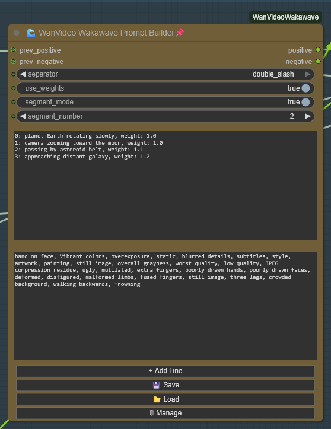
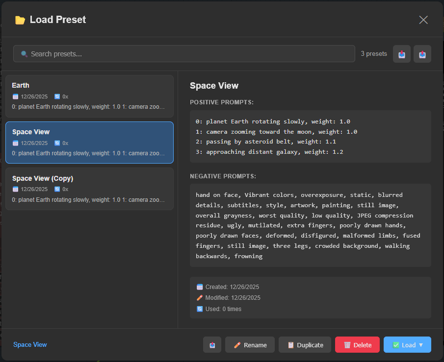

# 🌊 WanVideo Wakawave - Advanced LoRA & Prompt Tools

Advanced LoRA management and prompt building tools for WanVideo in ComfyUI.

**Two powerful nodes:**
- 🌊 **Wakawave LoRA Loader** - Dynamic LoRA management with unlimited add/remove
- 🌊 **Wakawave Prompt Builder** - Advanced prompt creation with segment support


---

## ✨ Features

### Wakawave LoRA Loader
- ✅ **Unlimited LoRAs** - Add/remove as many LoRAs as you need
- ✅ **Save/Load Presets** - Save your favorite LoRA combinations
- ✅ **Drag-to-Reorder** - Reorder LoRAs easily
- ✅ **Per-LoRA Strength** - Individual strength control for each LoRA
- ✅ **Enable/Disable Toggle** - Test different combinations quickly
- ✅ **Chainable** - Connect multiple loaders together
- ✅ **Compatible with WanVideo** - Outputs WANVIDLORA format

### Wakawave Prompt Builder
- ✅ **Dynamic Prompt Management** - Add/remove prompt lines on the fly
- ✅ **Weight Control** - Adjust emphasis for each prompt (0.5-2.0)
- ✅ **Save/Load Presets** - Save and recall prompt collections
- ✅ **Segment Mode** - Different prompts for different video segments
- ✅ **Multiple Separators** - Comma, newline, space, pipe, double slash, or none
- ✅ **Weighted Output** - Automatic formatting like `(prompt:1.2)`
- ✅ **Chainable** - Combine multiple prompt builders

---

## 📦 Installation

### Method 1: ComfyUI Manager (currently not implimented)
1. Open ComfyUI Manager
2. Search for "WanVideo Wakawave"
3. Click Install
4. Restart ComfyUI

### Method 2: Manual Installation (Recommended until comfyui manager integration)
```bash
cd ComfyUI/custom_nodes
git clone https://github.com/Wakapedia/ComfyUI-WanVideoWakawave.git
# Restart ComfyUI
```

### Method 3: Download ZIP
1. Download the latest release
2. Extract to `ComfyUI/custom_nodes/ComfyUI-WanVideoWakawave`
3. Restart ComfyUI

---

## 🎯 Usage

### Wakawave LoRA Loader

**Basic Usage:**
1. Add the node: Right-click → `WanVideo` → `Loaders` → `Wakawave LoRA Loader`
2. Click `+ Add LoRA` to add LoRAs
3. Select LoRAs from the dropdown
4. Adjust strength sliders (0-2.0)
5. Enable/disable with checkboxes
6. Connect output to `WanVideo Set LoRAs` node


**Save/Load Presets:**
- Click `💾 Save` to save current LoRA combination
- Click `📂 Load` to load a saved preset
- Click `🗑 Delete` to remove a preset

**Chaining Multiple Loaders:**
```
[LoRA Loader 1] → prev_lora → [LoRA Loader 2] → WanVideo Set LoRAs
```

### Wakawave Prompt Builder

**Outputs:**
- `positive` - Positive prompt text (STRING)
- `negative` - Negative prompt text (STRING)

**⚠️ Important:** The Prompt Builder outputs text (STRING), not embeddings. You must use **WanVideo TextEncode Cached** to convert text to embeddings before connecting to the sampler.

**Basic Usage:**
1. Add the node: Right-click → `WanVideo` → `Prompts` → `Wakawave Prompt Builder`
2. Type positive prompts in the top text box (one per line)
3. Type negative prompts in the bottom text box (optional)
4. Optional: Add weights like `prompt text, weight: 1.2`
5. Click `+ Add Line` for new prompt lines
6. Connect `positive` → **WanVideo TextEncode Cached** → sampler
7. Connect `negative` → **WanVideo TextEncode Cached** → sampler

**Prompt Builder Node Interface:**



**Visual Preset Browser:**



The visual preset browser features:
- **Search & Filter** - Find presets instantly
- **Live Preview** - See prompts before loading
- **Load Modes** - Load both, positive only, negative only, or append
- **Import/Export** - Share presets as JSON files
- **Rename, Duplicate, Delete** - Full preset management
- **Usage Tracking** - See which presets you use most

**Prompt Format:**
```
nebula in deep space, weight: 1.2
vibrant purple and blue colors, weight: 1.0
stars twinkling, weight: 0.8
```

Or simple format (defaults to weight 1.0):
```
nebula in deep space
vibrant purple and blue colors
stars twinkling
```

**Segment Mode (for 500+ frame videos):**
1. Enable `segment_mode`
2. Format prompts with segment numbers:
```
0: planet Earth rotating slowly, weight: 1.0
1: camera zooming toward the moon, weight: 1.0
2: passing by asteroid belt, weight: 1.1
3: approaching distant galaxy, weight: 1.2
```
3. Connect a segment counter to `segment_number` input
4. Each segment uses its corresponding prompts

**Separator Options:**
- **comma** → `prompt1, prompt2, prompt3` (default)
- **newline** → Prompts on separate lines
- **space** → `prompt1 prompt2 prompt3`
- **pipe** → `prompt1 | prompt2 | prompt3`
- **double_slash** → `prompt1 // prompt2 // prompt3`
- **none** → `prompt1prompt2prompt3`

---

## 🎬 Example Workflows

### Basic LoRA + Prompt Setup
```
[Wakawave LoRA Loader] → lora → [WanVideo Set LoRAs] → [WanVideo Model]

[Wakawave Prompt Builder]
   ├─ positive → [WanVideo TextEncode Cached] → positive_embeds ──┐
   └─ negative → [WanVideo TextEncode Cached] → negative_embeds ──┤
                                                                    ├─→ [WanVideo Sampler]
                                                                    │
                                                 [WanVideo Model] ──┘
```

### Multi-Segment Long Video (500+ frames)
```
[Segment Counter] → segment_number
                 ↓
[Wakawave Prompt Builder] (segment_mode: ON)
   ├─ positive → [WanVideo TextEncode Cached] → positive_embeds → [WanVideo Sampler]
   └─ negative → [WanVideo TextEncode Cached] → negative_embeds → [WanVideo Sampler]

Example segment prompts:
  Segment 0 (frames 0-76): "0: forest at dawn, mist rising"
  Segment 1 (frames 77-153): "1: sunlight breaking through trees"
  Segment 2 (frames 154-230): "2: birds flying through the canopy"
```

### Multiple LoRA Combinations
```
[Wakawave LoRA Loader 1] (style LoRAs)
         ↓ prev_lora
[Wakawave LoRA Loader 2] (character LoRAs) → [WanVideo Set LoRAs]
```

---

## ⚙️ Settings

### LoRA Loader Settings
- **prev_lora** (optional): Connect another LoRA loader to chain
- Hidden parameter: `lora_bundle` (JSON, managed by UI)

### Prompt Builder Settings
- **prev_prompt** (optional): Previous prompt to prepend
- **separator**: How to join prompts (comma/newline/space/pipe/double_slash/none)
- **use_weights**: Enable/disable weight syntax `(prompt:1.2)`
- **segment_mode**: Enable segment-based prompting
- **segment_number**: Current segment number (0-100)

---

## 📝 Tips & Best Practices

### LoRA Tips:
- Start with lower strengths (0.6-0.8) and increase gradually
- Order matters - earlier LoRAs have more influence
- Use presets to save working combinations
- Disable LoRAs to A/B test their impact

### Prompt Tips:
- **Main subject**: Weight 1.1-1.3
- **Important details**: Weight 1.0-1.2
- **Background/ambient**: Weight 0.7-0.9
- Stay between 0.5-1.5 for best results
- Save successful prompts as presets

### Segment Mode Tips:
- Match segment frames to your context window (e.g., 77 frames)
- Plan your video story with segment markers
- Use consistent weighting within segments
- Test individual segments before full render

---

## 🙏 Credits

**Inspired by:**
- [ND Super Nodes](https://github.com/HenkDz/nd-super-nodes) - UI framework and preset system
- WanVideo Wrapper team - Base LoRA implementation

**Created by:** Wakapedia

---

## 📄 License

MIT License - See [LICENSE](LICENSE) file for details

---

## 🐛 Issues & Support

Found a bug or have a feature request?
- Open an issue on [GitHub](https://github.com/Wakapedia/ComfyUI-WanVideoWakawave/issues)
- Include your ComfyUI version and error logs

---

## 🔄 Changelog

### v1.0.0 (Initial Release)
- 🌊 Wakawave LoRA Loader with unlimited LoRAs
- 🌊 Wakawave Prompt Builder with segment support
- ✅ Save/load presets for both nodes
- ✅ Drag-to-reorder functionality
- ✅ Weight control for prompts and LoRAs
- ✅ Multiple separator options
- ✅ Chainable nodes

---

**Enjoy creating amazing videos with Wakawave! 🌊**
